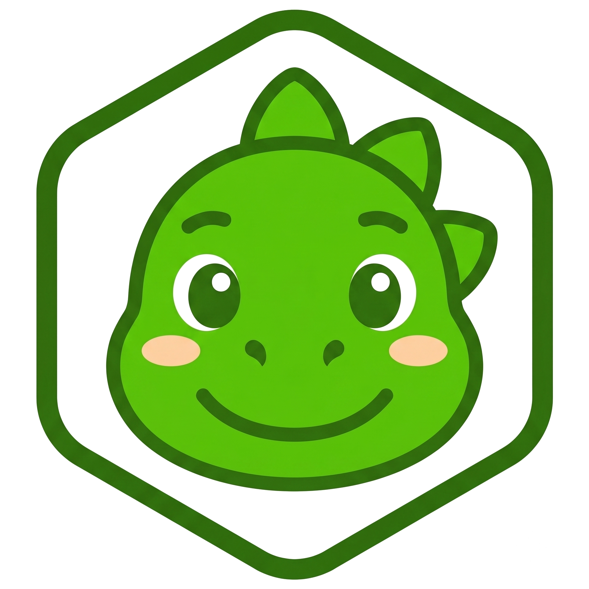

<div align="center">



# LEXORA

**Belajar kosakata bahasa Inggris dengan cara yang seru — journey path, game melawan waktu, streak, liga mingguan, dan Lexi si dinosaurus.**

[](https://github.com/KevinKautsarr/lexora/actions/workflows/ci.yml)
[](https://nextjs.org)
[](https://react.dev)
[](https://prisma.io)
[](https://tailwindcss.com)
[](LICENSE)

**🌐 Live demo: [lexorapp.vercel.app](https://lexorapp.vercel.app)**

</div>

---

## ✨ Fitur

### 📚 Belajar

- **Journey path bertingkat CEFR (A1–C1)** — 225 lesson / 1.800 kata tersusun per tingkat → unit → lesson, dengan unlock berantai yang ditegakkan tiga lapis (UI, guard halaman, validasi server). Peta bergaya petualangan dengan node zigzag, popover Mulai/Ulas, dan scenery ilustrasi.
- **Placement test anti-curang** — 12 soal pilihan ganda dibuat & dinilai sepenuhnya di server; klien tidak pernah menerima kunci jawaban.
- **Match Madness** — cocokkan kata Indonesia ↔ Inggris dalam 60 detik. Timer berbasis wall-clock (tidak bisa "dipause" lewat pindah tab), skor dihitung server.
- **Kamus** — seluruh kosakata per tingkat dengan pencarian dan tombol pengucapan (Web Speech API), tersusun accordion per unit.
- **Practice mode** — review acak kosakata dari lesson yang sudah selesai, tanpa memengaruhi XP.

### 🎮 Gamifikasi

- **XP & Level** — 500 XP per level; replay lesson hanya memberi ¼ XP (anti-farming).
- **Streak harian berbasis WIB** — batas hari dihitung UTC+7 (bukan UTC) sesuai pengguna Indonesia, dengan **streak freeze** yang menambal hari bolong otomatis.
- **Liga mingguan** — divisi Perunggu/Perak/Emas dengan promosi & degradasi otomatis tiap minggu (top 3 naik, bottom 3 turun), reset lazy tanpa cron.
- **Daily goals + peti hadiah** — 3 goal harian dengan hadiah gems & XP booster, modal peti dengan animasi & efek suara.
- **Toko gems** — beli streak freeze dan XP booster 2×; pembelian atomic (anti double-spend).
- **38 badge pencapaian** dalam 7 kategori, dihitung dari data belajar nyata tanpa flag tersimpan.
- **Efek suara** — nada marimba hasil sintesis sendiri untuk benar/salah/menang/kalah/hadiah, dengan toggle mute.

### 🔐 Akun & Keamanan

- **Better Auth** — email + password *dan* login Google (OAuth), dengan verifikasi email wajib sebelum masuk.
- **Reset password via email** (Resend) — token sekali pakai berlaku 1 jam, semua sesi lama dicabut setelah reset.
- **Manajemen sesi per perangkat** — lihat perangkat yang login (browser + OS + IP) dan keluarkan yang tak dikenali.
- **Hapus akun berlapis** — konfirmasi ketik email *plus* password (untuk akun credential).
- **Anti-cheat game** — skor hanya diterima dengan token HMAC bukti-mulai, durasi main minimal, laju match manusiawi, dan throttle antar-submit.
- **Security headers** — X-Frame-Options, nosniff, Referrer-Policy, Permissions-Policy di semua route.

### 🎨 Pengalaman

- Dark/light theme via CSS variables (toggle + ikut preferensi sistem), maskot Lexi dengan 20 pose, skeleton loading di semua route, halaman error bergaya sendiri, responsif mobile-first dengan bottom-nav + menu overflow, dan aksesibilitas (focus ring, aria, `prefers-reduced-motion`).

> _Screenshot menyusul — halaman Journey dan game Match Madness._
<!--  -->
<!--  -->

---

## 🧠 Dua Progres yang Sengaja Dibedakan

| | **Tingkat** (CEFR) | **Level** (XP) |
|---|---|---|
| Arti | Kemampuan bahasa: A1 Pemula → C1 Mahir | Progres bermain: `floor(xp/500)+1` |
| Berubah saat | Menyelesaikan lesson di tingkat lebih tinggi | Mengumpulkan XP |
| Ditampilkan | "Tingkat: Menengah (B1)" | "Level 4" |

---

## 🛠 Tech Stack

| Lapisan | Teknologi |
|---|---|
| Framework | Next.js 16 (App Router, Turbopack) + React 19 + TypeScript |
| Database | PostgreSQL serverless ([Neon](https://neon.tech)) via Prisma 7 + `@prisma/adapter-neon` |
| Auth | [Better Auth](https://better-auth.com) — session di database, Google OAuth, verifikasi email |
| Email | [Resend](https://resend.com) — reset password & verifikasi (via fetch, tanpa SDK) |
| UI | Tailwind CSS v4 (design token `@theme`), lucide-react, font Baloo 2 + Geist |
| Testing & CI | Vitest (71 unit test) + GitHub Actions (typecheck, lint, test tiap push) |
| Deploy | Vercel — function di-pin ke `sin1` (Singapore), satu region dengan database |

### Keputusan arsitektur

- **Server Components untuk semua read** — halaman meng-query Prisma langsung; tidak ada API route untuk fetching.
- **Server Actions untuk semua mutasi** — tiap action memvalidasi sesi + input + kepemilikan di server, lalu `revalidatePath` menyegarkan UI dalam satu roundtrip.
- **Logika murni terisolasi di `lib/`** (`streak.ts`, `scoring.ts`, `queue.ts`, `placement.ts`, `game-token-core.ts`) — bebas framework, teruji unit, dipakai bersama oleh halaman dan validasi server.
- **Anti-cheat stateless** — token HMAC (`timingSafeEqual`) membuktikan kapan sesi game dimulai, tanpa tabel tambahan.
- **Reset liga lazy & batched** — terpicu request pertama tiap minggu, dieksekusi ±7 `updateMany` berapa pun jumlah user.

---

## 🚀 Menjalankan Secara Lokal

```bash
git clone https://github.com/KevinKautsarr/lexora.git
cd lexora
npm install                     # prisma generate otomatis via postinstall

cp .env.example .env            # lalu isi nilainya (lihat komentar di dalamnya)

npx prisma migrate dev          # buat tabel
npx prisma db seed              # isi 5 tingkat CEFR / 225 lesson / 1.800 kata

npm run dev                     # http://localhost:3000
```

Environment yang dibutuhkan (detail di [`.env.example`](.env.example)):

| Variabel | Wajib | Keterangan |
|---|---|---|
| `DATABASE_URL` | ✅ | Connection string Neon |
| `BETTER_AUTH_SECRET` | ✅ | `openssl rand -hex 32` |
| `BETTER_AUTH_URL` | ✅ | `http://localhost:3000` (dev) |
| `RESEND_API_KEY` | ✅ | Verifikasi email & reset password |
| `GOOGLE_CLIENT_ID` / `GOOGLE_CLIENT_SECRET` | ⬜ | Login Google (opsional) |
| `EMAIL_FROM` | ⬜ | Kosongkan untuk testing |

### Perintah lain

| Perintah | Fungsi |
|---|---|
| `npm test` | 71 unit test (streak, scoring, queue, placement, token, dll) |
| `npm run lint` | ESLint |
| `npm run format` | Prettier |
| `npx prisma studio` | GUI database |

---

## ☁️ Deploy ke Vercel

1. Push repo ke GitHub (`.env` ter-gitignore).
2. Import di Vercel — preset Next.js default sudah benar; region function sudah di-pin ke Singapore via `vercel.json`.
3. Isi environment variables (nilai production: `BETTER_AUTH_URL` = domain kamu, kredensial Google dengan redirect URI production).
4. Migrasi dijalankan dari mesin dev (`npx prisma migrate dev`), bukan oleh build Vercel.

> **Catatan:** error origin/CSRF saat login hampir pasti berarti `BETTER_AUTH_URL` tidak cocok dengan domain.

---

## 📁 Struktur Singkat

```
app/
  (app)/          # halaman ber-login: learn, game, dictionary, leaderboard,
                  # goals, streak, shop, profile, settings
  (auth)/         # login, register, forgot/reset password
  page.tsx        # landing page publik
components/       # UI bersama (Mascot, JourneyPath, BottomNav, …)
lib/              # logika murni + infrastruktur (streak, scoring, auth, email)
prisma/           # schema, migrasi, seed (vocabulary-seed.json)
tests/            # unit test Vitest
```

---

## 📄 Lisensi

Dirilis di bawah [Lisensi MIT](LICENSE) — bebas dipakai, dimodifikasi, dan didistribusikan dengan menyertakan atribusi.

<div align="center">

Dibangun dengan 💚 oleh [Kevin Kautsar](https://github.com/KevinKautsarr)

</div>
